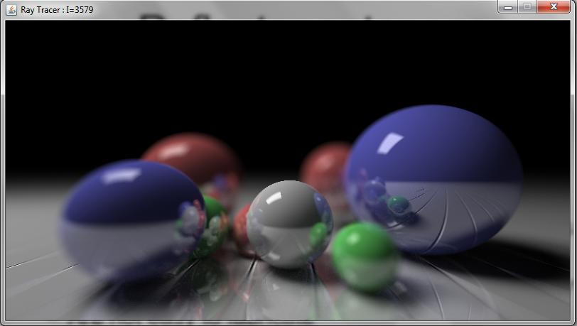

RayTracer
=========

A realistic ray tracer implementation using Monte Carlo Integration.

## Overview of Features
### Graphics
- Basic 3d rendering using a slightly modified version of the default libgdx 3d shader. It takes advantage of the new libgdx 3D API.
- 3D Particle system based on the new libgdx 3d particle system (version 1.2.1+, not included in 1.2.0)
